# robot_vinn
这个是低成本实现模仿学习的机械臂，打算是做到[ALOHA](https://mobile-aloha.github.io/)的那样的，看了[act](https://github.com/tonyzhaozh/act)的代码，感觉目前对模仿学习的理论不够，就用了[VINN](https://jyopari.github.io/VINN/)的模仿学习算法，这个相对来说好实现。
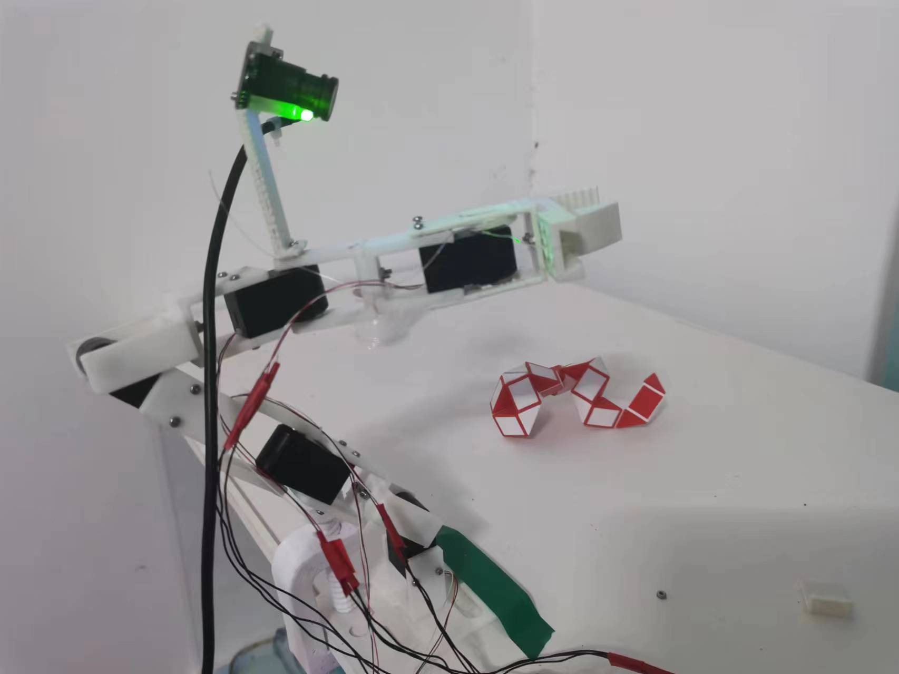

## 硬件介绍
* 舵机

这个舵机是总线舵机，可以直接串口控制，很方便，详细的使用可以看看这个[b站的视频](https://www.bilibili.com/video/BV16T4y1p7Uz/?spm_id_from=333.337.search-card.all.click&vd_source=daaf9bf645fcaef4e28e8de817ad2d2d)
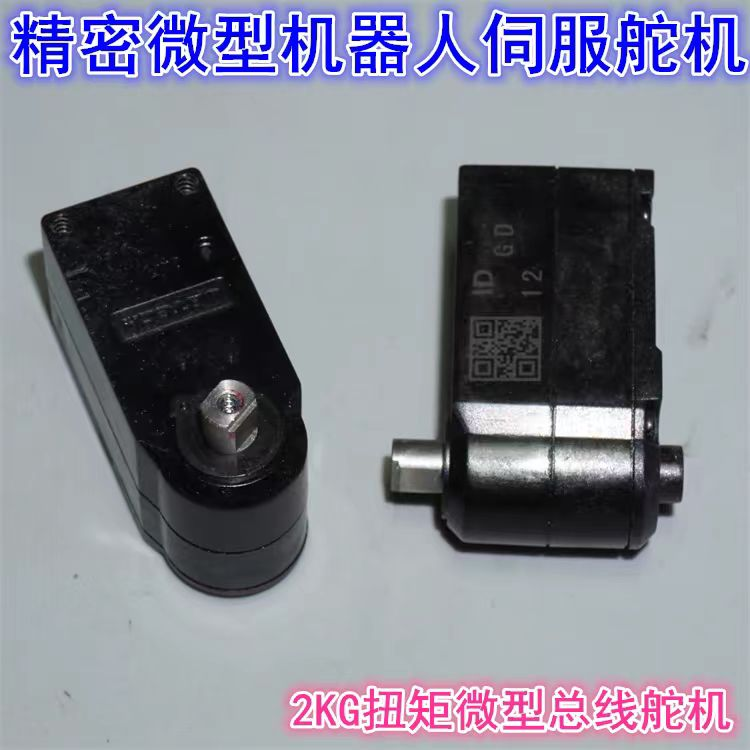
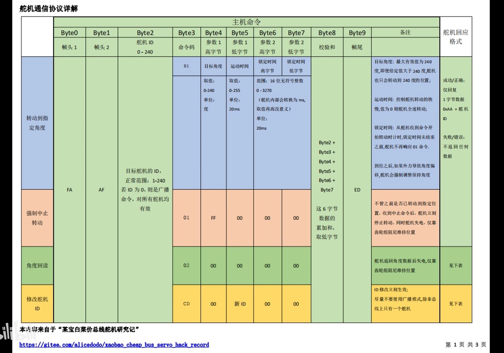
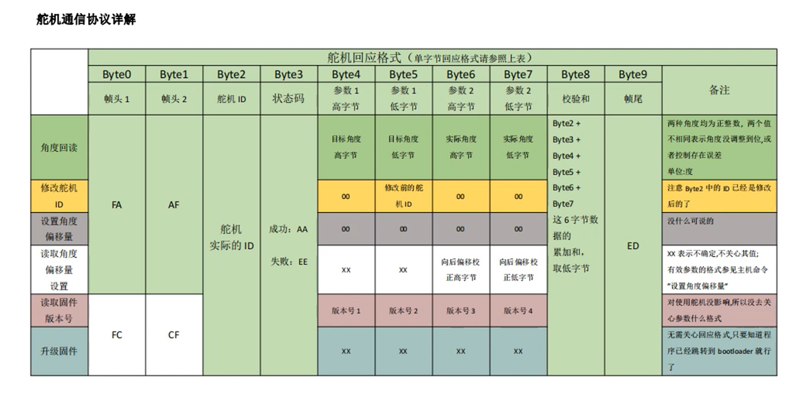

* 轴承

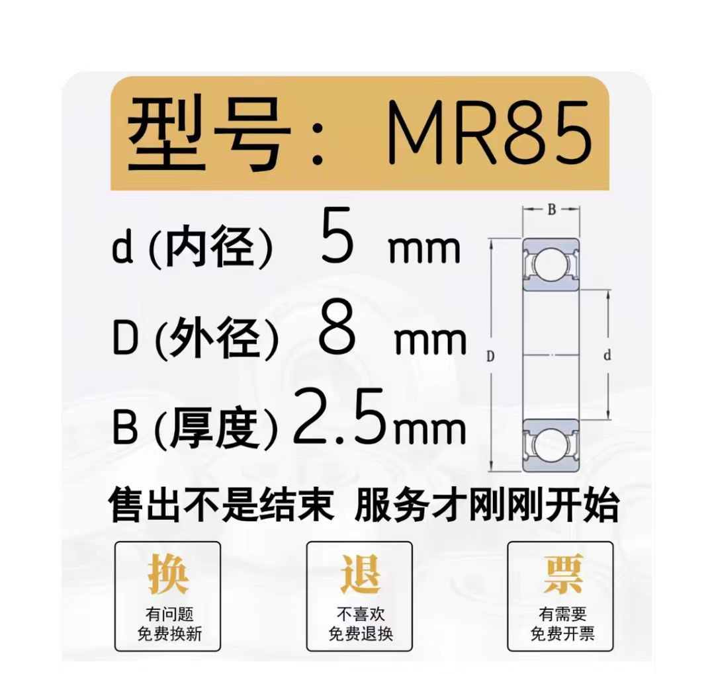

* M2螺丝，6mm和10mm，M2的自锁螺母

* 电池

推荐这个样2s的7.4v的航模电池，XT60插头的即可
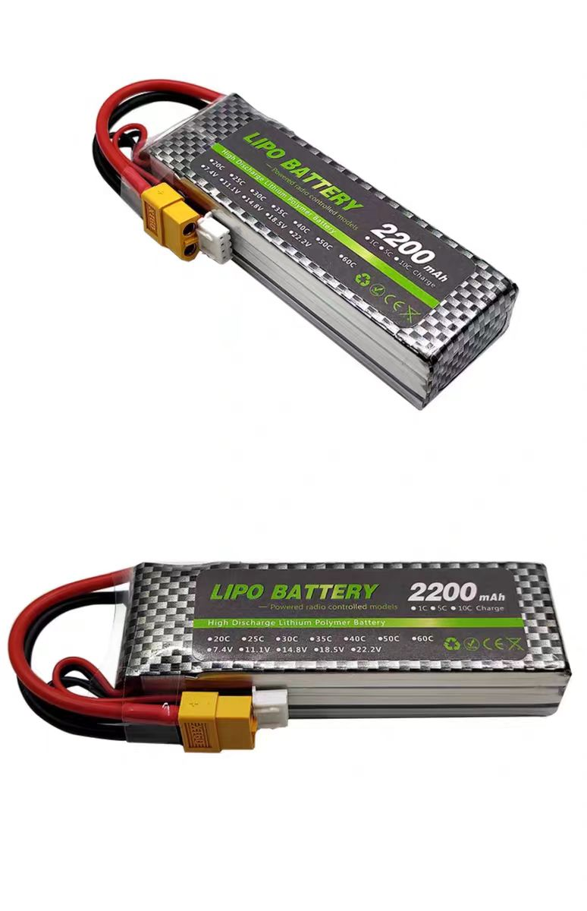

## 3D结构
进行拼装后
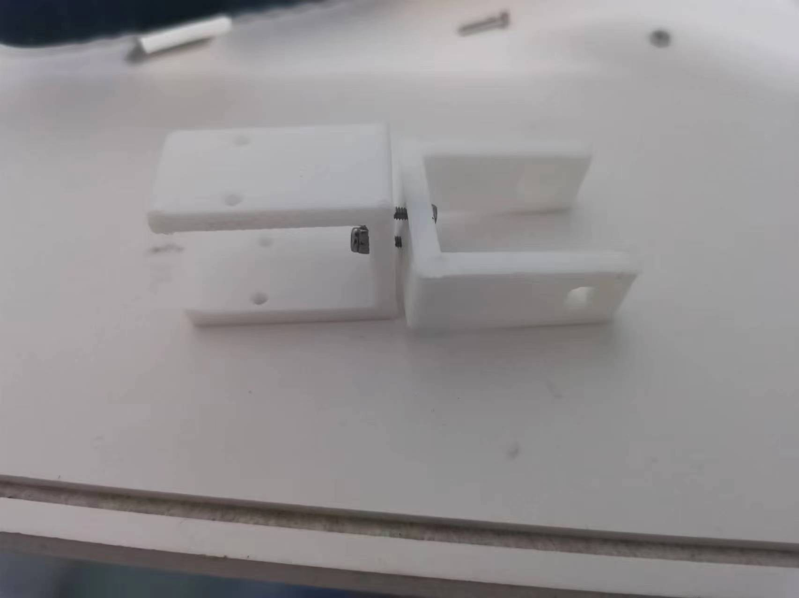
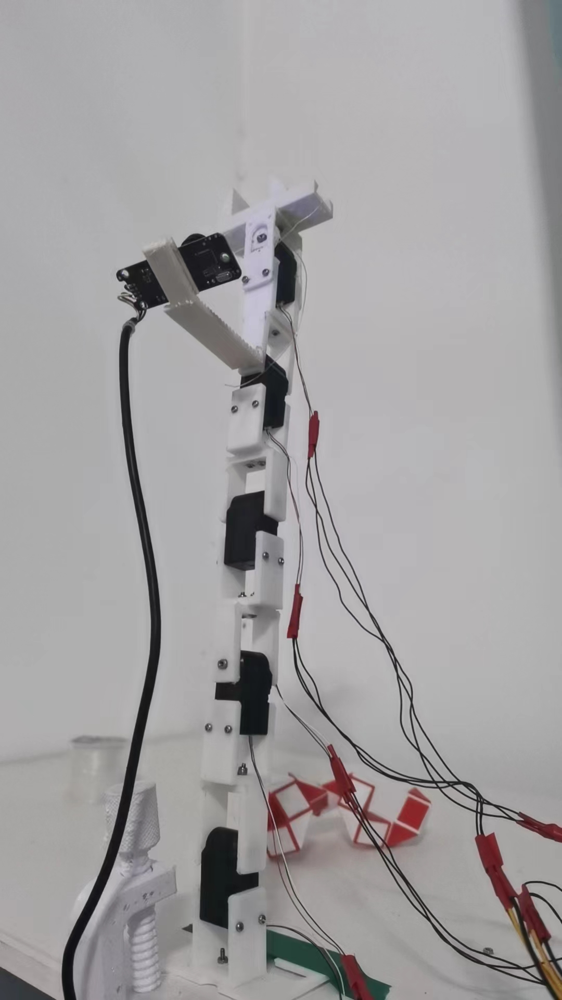

## PCB设计
这个是拜托了实验室的学长设计的，比较简单的设计，嘉立创打样，要打样文件的私聊
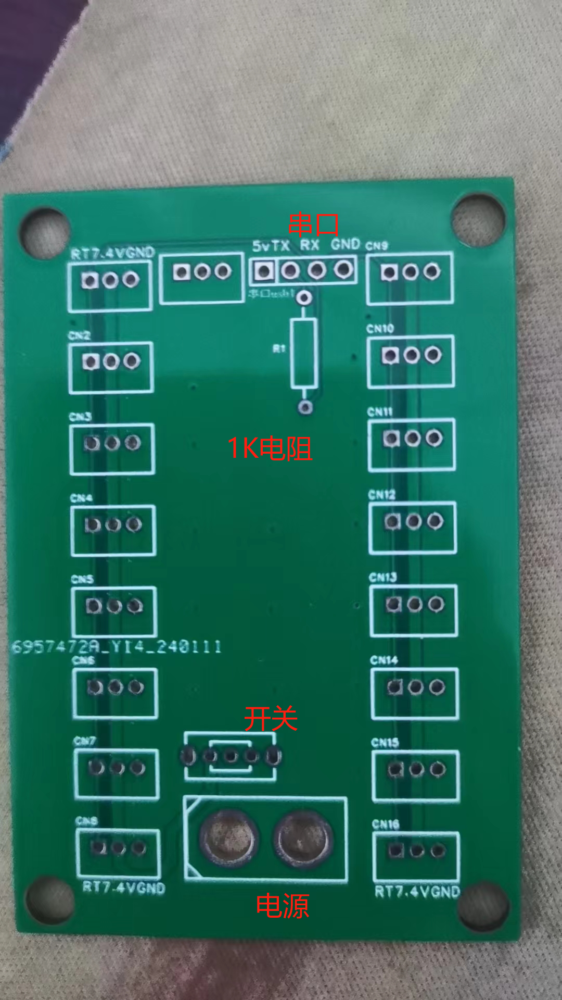
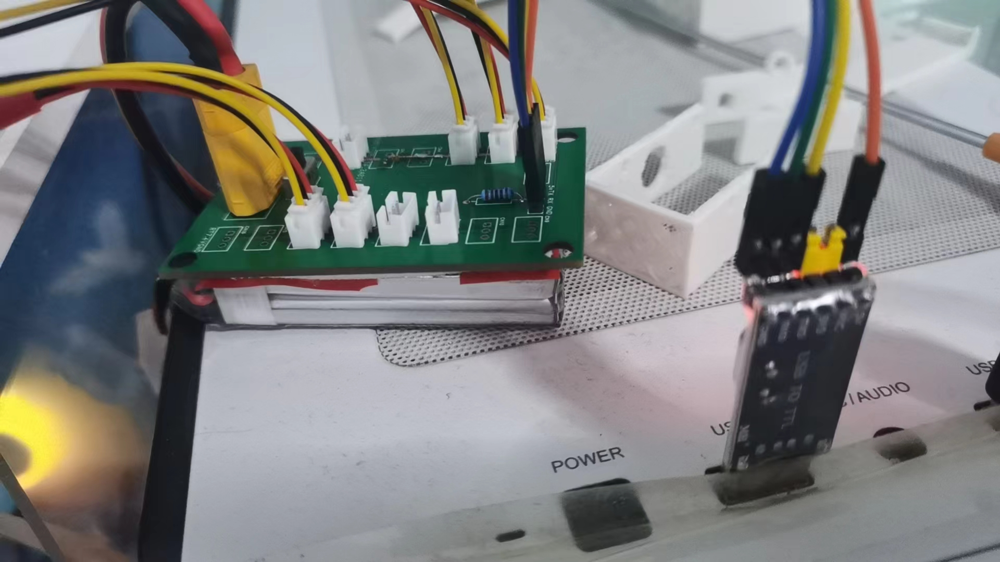

## 配置环境
要额外自己安装torch和torchivision，因为国内不好安装gpu版，我就没放到requirements里
```bash
conda create -n robot_vinn python=3.10
conda activate robot_vinn
cd robot_vinn
pip install -r requirements.txt
```

## 使用
要保证连上了串口，我这个默认是COM3，根据自身的需求在servo_utils.py里改成自己的
```bash
python main.py
```
运行后，页面1是可以直接控制机械臂；页面2是自己来手动改变机械臂的形态来记录数据和摄像头的图像，要保存图像，要把摄像头开始录制才行；页面3是修改舵机的id，这个很重要，我是用了5个舵机，从下到上id为1到5.

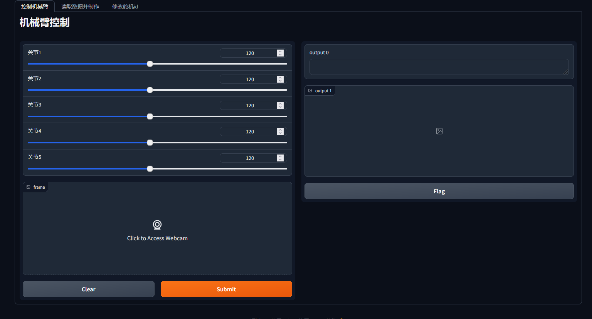
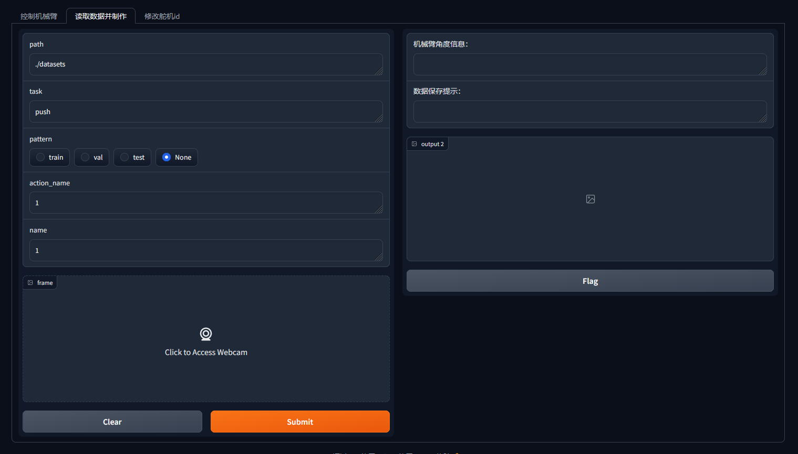

数据集的结构是
+ datasets
  + task_name(如push)
    + train 
      + 1
        + 1.png
        + 1.json
        + 2.png
        + 2.json
        +
        +
      + 2
      + 3
    + test
    + val
  + task_name(如stack)

在config里配置好了以后就可以在BYOL.py训练，训练好的权重在config.py里引用后可以在vinn.py里执行了


